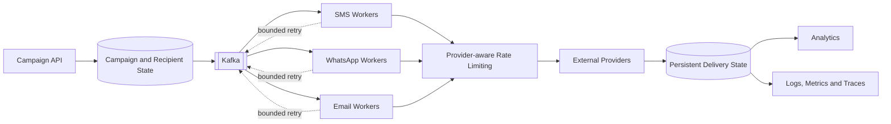
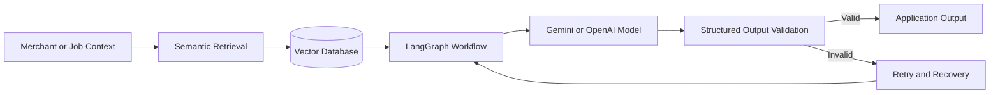
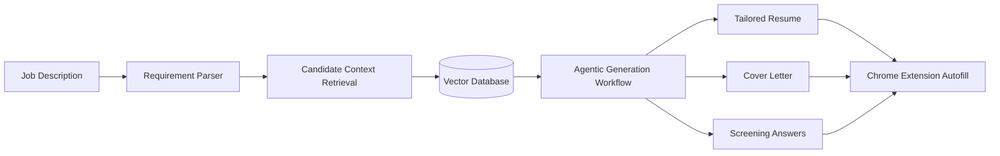

<!--
  GitHub Profile README for github.com/dbs-mnnit
  Built around backend engineering, distributed systems, and production AI.
-->

<div align="center">


<a href="https://git.io/typing-svg">
  
</a>

<br />

<a href="mailto:aksbhabua09@gmail.com"></a>
<a href="https://www.linkedin.com/in/digvijay1803"></a>
<a href="https://leetcode.com/u/dbs_mnnit"></a>
<a href="https://github.com/dbs-mnnit"></a>

<br /><br />


</div>

---

## Engineering systems that do not panic when traffic does

I am a **Backend Software Engineer** who designs scalable, fault-tolerant platforms for customer engagement, campaign automation, payments, analytics, and AI-powered workflows.

My work sits where systems become difficult: **high throughput, partial failure, duplicate delivery, provider limits, asynchronous execution, database bottlenecks, and unreliable model output**. I turn those constraints into APIs and workflows that are measurable, recoverable, and safe to retry.

```java
public final class EngineeringProfile {
    String role = "Backend Software Engineer";

    List<String> core = List.of(
        "Distributed Systems",
        "Event-Driven Architecture",
        "Backend Scalability",
        "Database Performance",
        "Production AI Workflows"
    );

    String principle =
        "A system is production-ready when failure is expected, observable, and recoverable.";
}
```

---

## Production impact

<table>
<tr>
<td align="center" width="25%">
  <h2>10M+</h2>
  <sub>API requests handled per day</sub>
</td>
<td align="center" width="25%">
  <h2>5M+</h2>
  <sub>SMS, WhatsApp and email messages per day</sub>
</td>
<td align="center" width="25%">
  <h2>10K+</h2>
  <sub>Messages processed per second</sub>
</td>
<td align="center" width="25%">
  <h2>5,000+</h2>
  <sub>Active merchants supported</sub>
</td>
</tr>
<tr>
<td align="center">
  <h2>200K+</h2>
  <sub>Customers supported</sub>
</td>
<td align="center">
  <h2>95%+</h2>
  <sub>Reduction in duplicate notifications</sub>
</td>
<td align="center">
  <h2>70%+</h2>
  <sub>Faster critical MongoDB APIs</sub>
</td>
<td align="center">
  <h2>99%+</h2>
  <sub>Valid structured AI generations</sub>
</td>
</tr>
</table>

---

## What I engineer

<table>
<tr>
<td width="33%" valign="top">

### High-throughput backends

APIs and services designed for sustained traffic, predictable latency, efficient pagination, and clean service boundaries.

**Focus:** REST APIs, Spring Boot, Node.js, MongoDB, PostgreSQL, caching, testing.

</td>
<td width="33%" valign="top">

### Correctness under failure

Asynchronous systems where retries, duplicates, provider failures, and partial completion are handled deliberately.

**Focus:** Kafka, Redis, idempotency, queues, dead-letter flows, rate limiting, distributed locks.

</td>
<td width="33%" valign="top">

### Production AI systems

LLM workflows that retrieve the right context, return validated structures, and recover from model or provider failures.

**Focus:** LangChain, LangGraph, RAG, vector databases, tool calling, caching, structured outputs.

</td>
</tr>
</table>

---

## A system blueprint I work with



The important part is not the happy path. It is what happens when a consumer restarts, a provider throttles, a request is retried, or the same event appears twice.

**Design concerns I treat as first-class requirements:**

`Idempotency` · `Durable state` · `Bounded retries` · `Dead-letter handling` · `Rate limits` · `Safe reprocessing` · `Observability`

---

## AI workflow architecture



I have built AI workflows with semantic retrieval, metadata filtering, async execution, caching, retries, and structured outputs—reducing campaign creation from hours to **under five minutes** and improving content relevance by **35%+**.

---

## Technology constellation

<div align="center">

### Languages


### Backend, data and messaging


### Cloud, delivery and observability


<br /><br />


</div>

---

## Experience snapshot

<details open>
<summary><strong>Backend Software Engineer · SmartOrbit</strong> &nbsp; <code>May 2024 — Present</code></summary>
<br />

Working on **Loyaltty**, a customer engagement and loyalty platform serving thousands of merchants and hundreds of thousands of customers.

- Built backend services across loyalty, campaigns, billing, analytics, and AI-powered campaign creation.
- Designed a Kafka-based multi-channel messaging system processing **5M+ messages/day** at **10K+ messages/second**.
- Reduced duplicate notifications by **95%+** with Redis-backed idempotency, persistent delivery states, and controlled retries.
- Improved critical MongoDB response times by **70%+** through compound indexing, aggregation optimization, query-plan analysis, and efficient pagination.
- Built fault-tolerant workflows with bounded retries, dead-letter queues, provider tracking, and safe reprocessing.
- Reduced production debugging time by **50%+** with structured logging and end-to-end tracing.
- Built LangGraph and RAG pipelines for campaign planning, generation, retrieval, validation, and recovery.

</details>

---

## Featured build — FastFill

### AI resume, cover-letter and job-autofill extension

FastFill retrieves relevant candidate context for a job description, generates tailored application material, and uses Chrome Extension APIs to automate form completion.



**Engineering behind it:** LangChain · RAG · VectorDB · LLMs · structured generation · agentic workflows · browser automation

---

## Competitive programming

<table>
<tr>
<td width="55%" valign="middle">

- Solved **1,000+** Data Structures and Algorithms problems.
- Achieved **Expert** rating on Codeforces.
- Secured **Global Rank < 500** in a CodeChef contest.
- Participated in **Google Kick Start** and **Meta Hacker Cup**.

</td>
<td width="45%" align="center">

<a href="https://leetcode.com/u/dbs_mnnit">
  
</a>

</td>
</tr>
</table>

---

## Engineering principles

<table>
<tr>
<td align="center" width="25%"><strong>Correctness before cleverness</strong></td>
<td align="center" width="25%"><strong>Retries must be safe</strong></td>
<td align="center" width="25%"><strong>Observability is a feature</strong></td>
<td align="center" width="25%"><strong>Failure is part of the design</strong></td>
</tr>
</table>

> I do not just ask, “Will this work?” I ask, “What happens when it runs twice, fails halfway, or receives 100× the expected traffic?”

---

## GitHub activity

<div align="center">


<br /><br />


</div>

---

## Let us talk engineering

<div align="center">

I enjoy discussing backend architecture, distributed systems, database performance, production AI, and difficult system-design trade-offs.

<br />

<a href="mailto:aksbhabua09@gmail.com"></a>
<a href="https://www.linkedin.com/in/digvijay1803"></a>

<br /><br />

### Build for the happy path. Engineer for everything after it.


</div>
